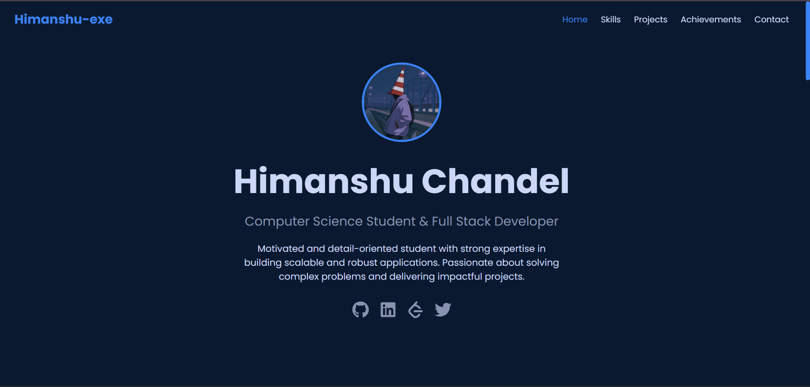
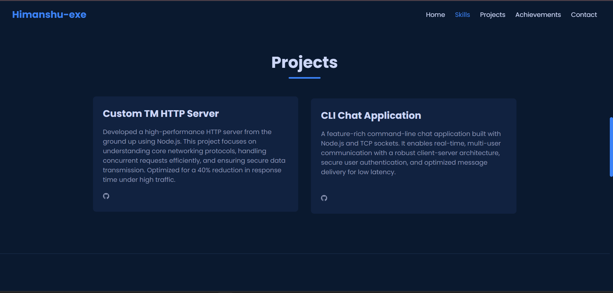
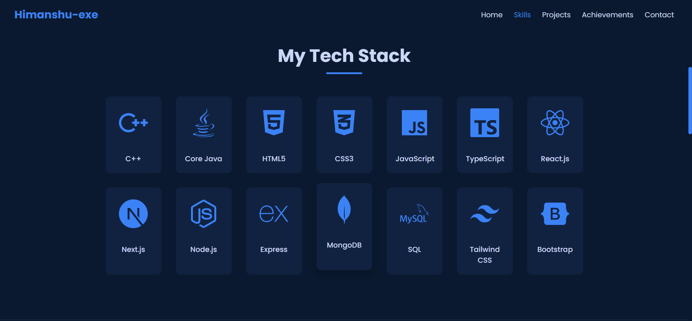
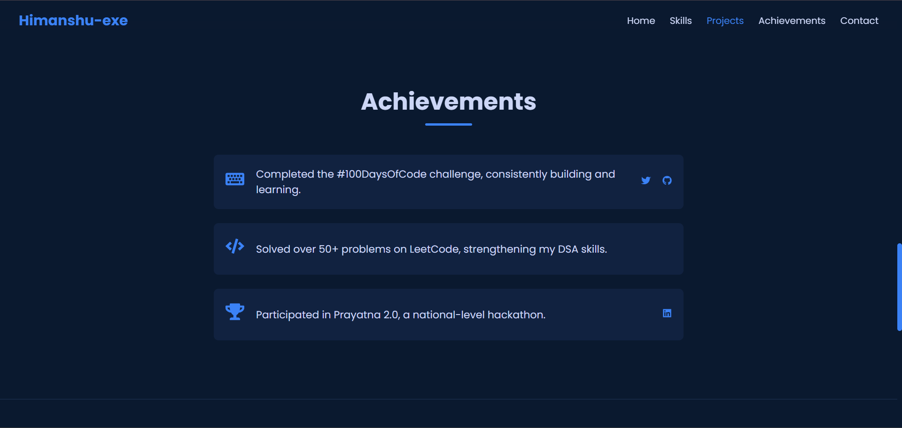
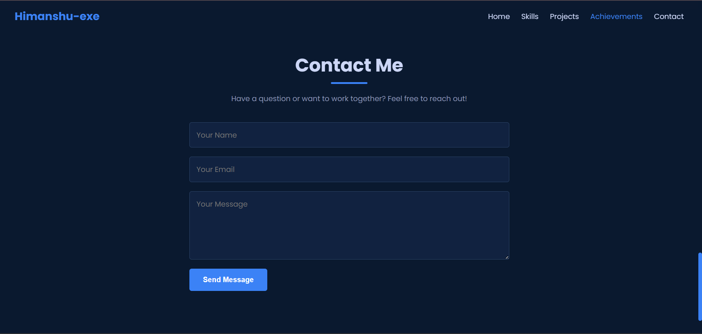
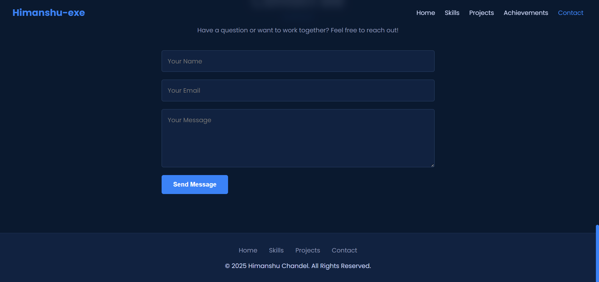

# 🌐 Personal Portfolio Website

This is my **personal portfolio website** built using **React.js** to showcase my skills, projects, achievements, and experience.  
It serves as a central hub for recruiters, collaborators, and anyone interested in learning more about my work.  

🔗 **Live Demo:** [himanshuuu-exe.github.io/himanshu-portfolio](https://himanshuuu-exe.github.io/himanshu-portfolio/)

---

## 📸 Preview

### 🏠 Home


### 💼 Projects


### 🛠️ Skills


### 🏆 Achievements


### ✉️ Contact


### ⚙️ Extra



---

## 🚀 Features

- 🎨 **Modern UI/UX** with responsive design  
- 🌓 **Dark/Light mode** ready (currently dark-themed)  
- 📂 Projects showcase with links to live demos & GitHub repos  
- 📧 Contact form integration for direct communication  
- ⚡ Fast and optimized performance  
- 📱 Fully responsive across devices  

---

## 🛠️ Tech Stack

- **Frontend:** React.js, HTML5, CSS3, JavaScript (ES6+)  
- **Styling:** Tailwind CSS  
- **Icons & UI:** React Icons  
- **Deployment:** GitHub Pages  
- **Other Tools:** Git, npm  
- **Data base:** mongodb  

---

## 📂 Folder Structure

```bash
portfolio/
├── public/             # Static files
│   ├── screenshots/    # Screenshots used in README
│   │   ├── main.png
│   │   ├── proj.png
│   │   ├── cont.png
│   │   ├── tech_S.png
│   │   ├── ach.png
│   │   └── {EAA88BCB-E28D-4430-BFFC-CF5A7273F97A}.png
├── src/
│   ├── assets/         # Images, logos, icons
│   ├── components/     # Reusable components
│   ├── pages/          # Main sections (Home, Skills, Projects, Achievements, Contact)
│   ├── App.js          # Root component
│   ├── index.js        # Entry point
├── package.json        # Project metadata & dependencies

---

## ⚙️ Installation & Setup

1. Clone the repo  
   ```bash
   git clone https://github.com/himanshuuu-exe/himanshu-portfolio.git
Navigate to project directory

bash
Copy code
cd himanshu-portfolio
Install dependencies

bash
Copy code
npm install
Run the development server

bash
Copy code
npm start
The app will be running at http://localhost:3000/

---


🌍 Deployment
This portfolio is deployed on GitHub Pages.
To deploy your own version:

bash
Copy code
npm run deploy
🤝 Contributing
Contributions are welcome! If you find a bug or want to add a feature:

Fork the repo

Create a new branch (feature-branch)

Commit your changes

Push and open a Pull Request

---

📬 Contact
💼 Portfolio: himanshuuu-exe.github.io/himanshu-portfolio

📧 Email: your-chandelhimanshu20email@example.com

💻 GitHub: @himanshuuu-exe

🔗 LinkedIn: https://www.linkedin.com/in/himanshu-chandel-38a3402a2/
